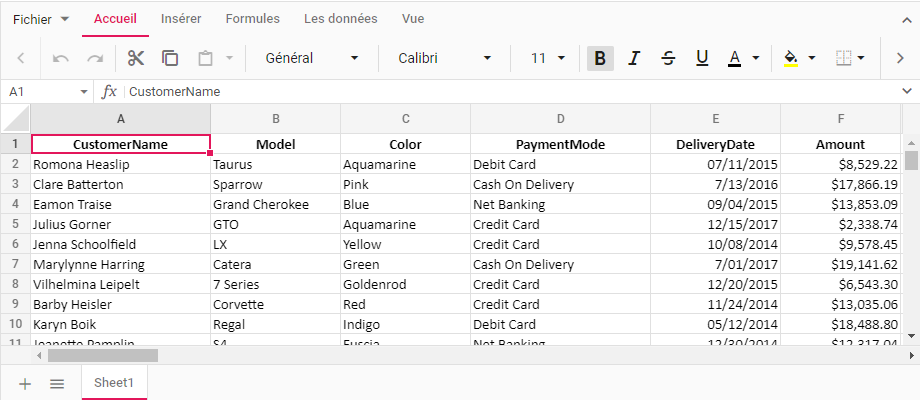

# Globalization in ASP.NET MVC Spreadsheet control

## Localization

The [Localization](https://ej2.syncfusion.com/aspnetmvc/documentation/common/localization/) library allows you to localize the default text content of the Spreadsheet. The Spreadsheet has static text on some features (cell formatting, Merge, Data validation, etc.) that can be changed to other cultures (Arabic, Deutsch, French, etc.) by defining the
[locale](https://help.syncfusion.com/cr/aspnetcore-js2/Syncfusion.EJ2.Spreadsheet.Spreadsheet.html#Syncfusion_EJ2_Spreadsheet_Spreadsheet_Locale) value and translation object. 

> You can refer to the locale keywords and their text in this [link](https://github.com/syncfusion/ej2-locale/) for different cultures.

### Loading translations

Other than the default English culture, if you need it, you can localize the default text of the Spreadsheet through the [load](../common/internationalization/#load) method of the [L10n](https://ej2.syncfusion.com/aspnetmvc/documentation/common/localization/) class and set the culture by using the [locale](https://help.syncfusion.com/cr/aspnetcore-js2/Syncfusion.EJ2.Spreadsheet.Spreadsheet.html#Syncfusion_EJ2_Spreadsheet_Spreadsheet_Locale) property.

The following example demonstrates the Spreadsheet in `French` culture. In the below sample we have translated the ribbon tab names and Home tab content (clipboard, cell style).






























## Internationalization

The Internationalization library is used to globalize number, date, and time values in the spreadsheet component. To achieve this, you need to install the CLDR data NPM packages and load the dependent JSON files by using the `loadCldr` function. To set the default culture and currency code, you can use the `setCulture` and `setCurrencyCode` methods.

The following example demonstrates the Spreadsheet in French [ `fr-CH`] culture. In the below sample we have globalized the Date(Date column), Time(Time column), and Currency(Amount column) formats.






























## Right to left (RTL)

RTL provides an option to switch the text direction and layout of the Spreadsheet component from right to left. It improves the user experiences and accessibility for users who use right-to-left languages (Arabic, Farsi, Urdu, etc.). To enable RTL Spreadsheet, set the [enableRtl](https://help.syncfusion.com/cr/aspnetcore-js2/Syncfusion.EJ2.Spreadsheet.Spreadsheet.html#Syncfusion_EJ2_Spreadsheet_Spreadsheet_EnableRtl) to true.






























## See Also

* [Localization](../common/localization)
